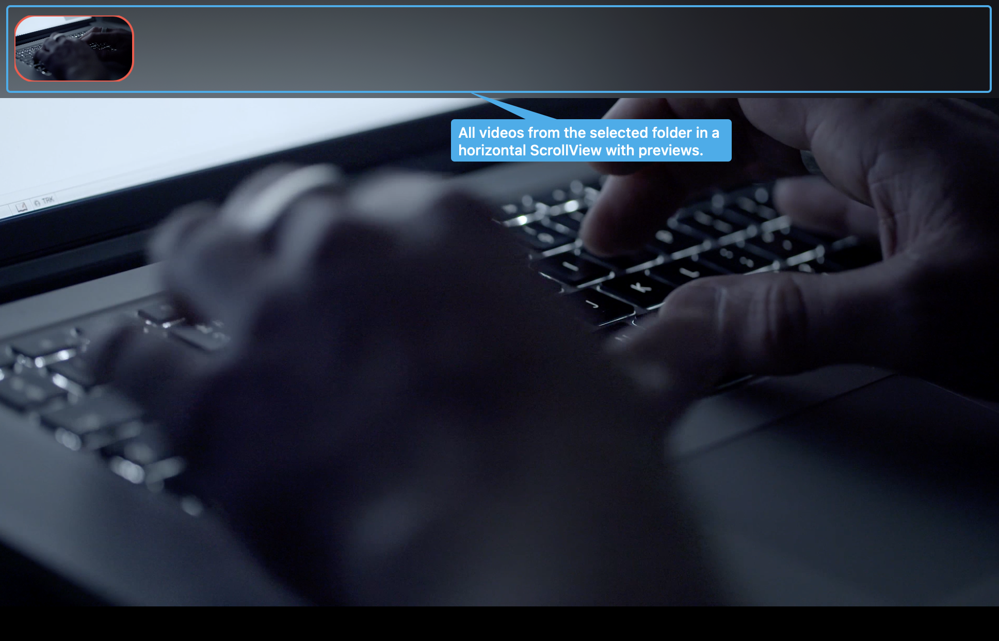
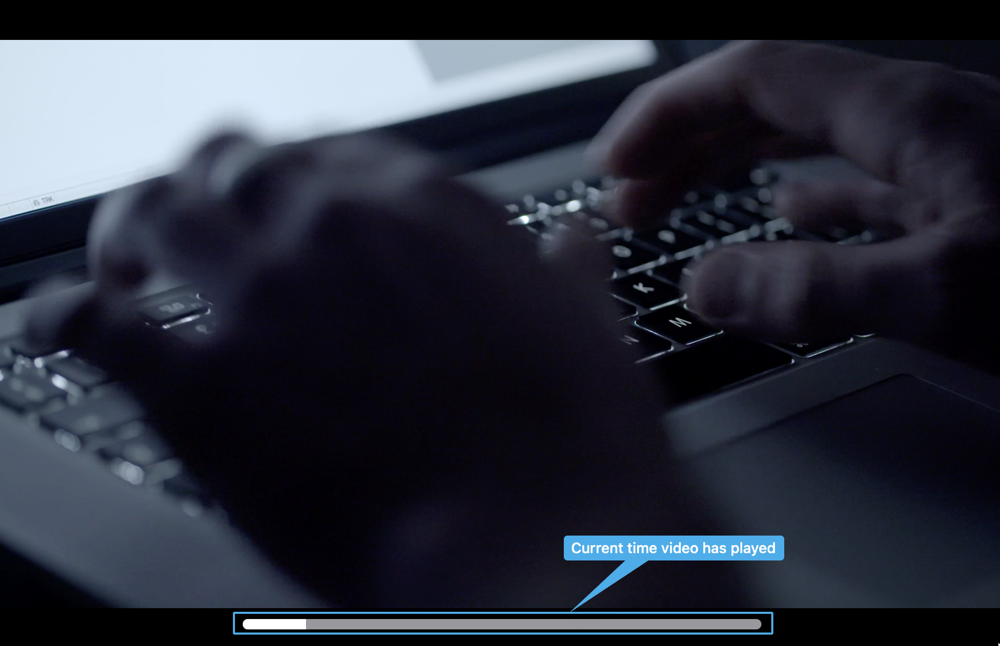
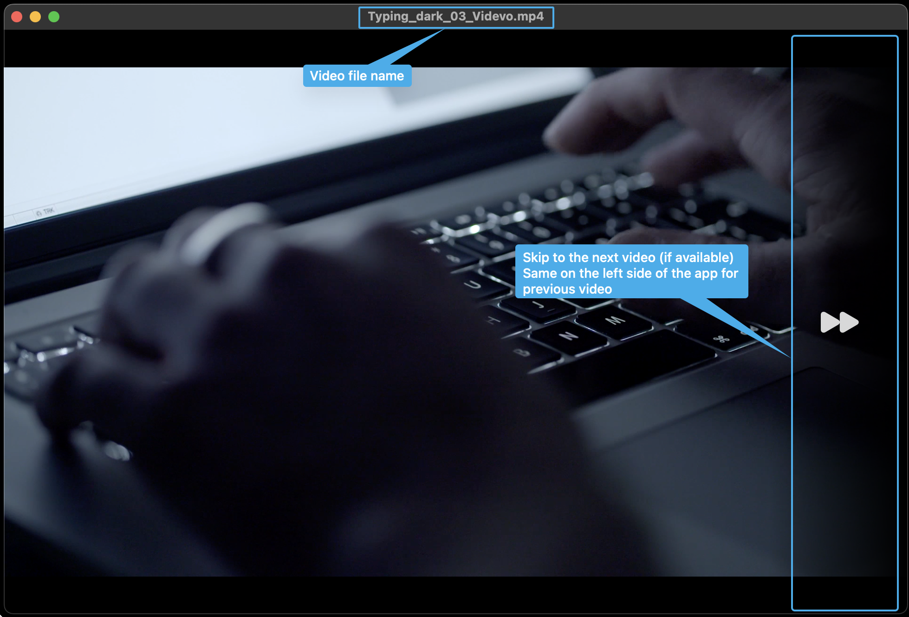
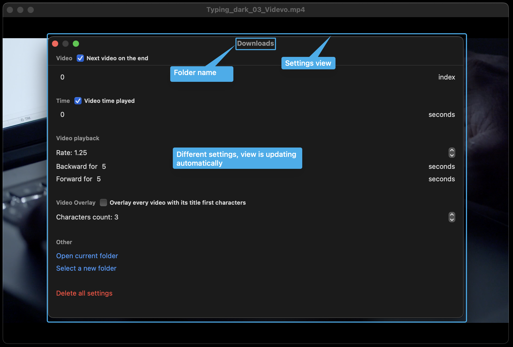

# VideoPlayer

## Description

It is a video player, where you can choose a folder to watch videos from. All videos from the folder are placed on the top in a horizontal scroll, where you can choose one to watch. You can skip video, skip X seconds using hotkeys forward and backward.\
Some settings may be configured in a Settings view - `Cmd + ,`

## Screenshots

    

    

    

    

## P. S

I made this app, because didn't find one, which will meet my requirements on macOS, the concept was taken from Windows 11 video player.
